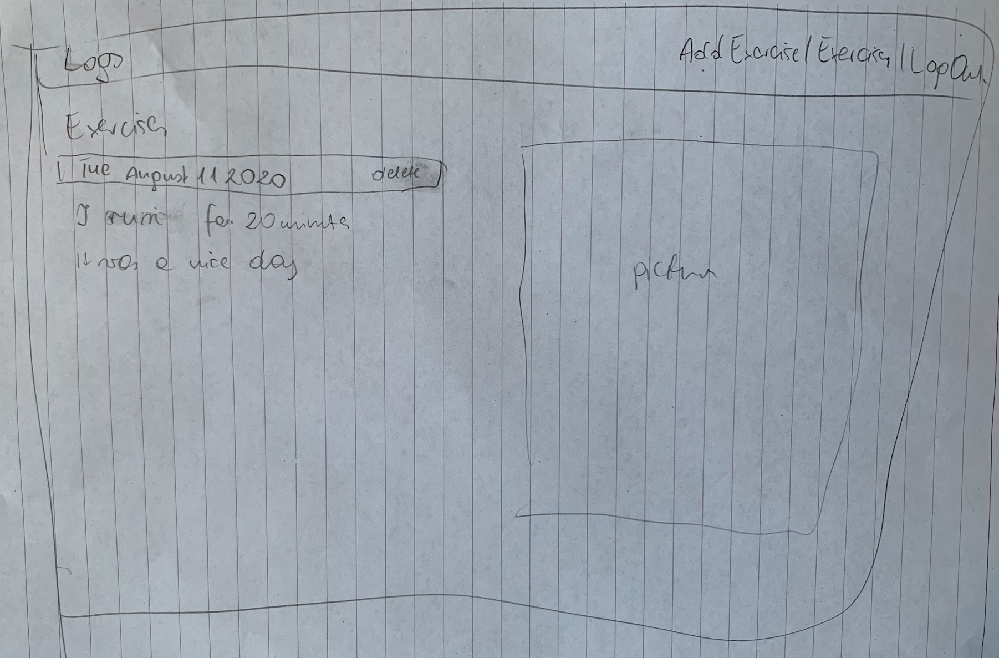

# Fitter
The app allows its users to keep track of their daily exercise routine

## Working Prototype
You can access a working prototype of the React app here: https://search-for-country-to-visit-casptone-client.vercel.app/ and Node app here: https://country-search-server-app.herokuapp.com

## User Stories
This app is for logged in users only

#### Landing Page
* As a new user 
* I would like to understand what the page is about
* so that I can use the app efficiently 
* As a new user 
* I want to be able to create a new account
* so that I can access the exercise tracker
* As a new user and returning user 
* I would like to be able to log out of my account
* so that I can stop using the app
* As a new user 
* I want to be able to sign in into my account
* so that I can start using my tracker

#### Add Exercise Page
* As a new and returning user 
* I want to be able to add new exercises to my list
* so that I can keep track of my exercises

#### Exercise Tracker Page
* As a new and returning user
* I want to be able to view all my activities 
* So that I can see my progress

#### Mobile Version
* As a new and returning user 
* I would like to view the website on both mobile devices and desktop computers
* so that I can use it on multiple devices

#### Accessibility
* As a user with disabilities 
* I would like to navigate the website with the use of keyboard
* so that I can use the website 
* As a user with disabilities 
* I would like for the website to keep high contrast for visibility
* so that I can see the displayed web app accordingly
* As a user with disabilities 
* I would like for the website to be accessible (ARIA)
* so that I have no problems with using the app
* As a user with disabilities 
* I would like for the website to be well structured for the screen readers’s accesibility
* so that I can use screen reader efficiently

### Wireframes
Landing/Login Page
:-------------------------:

Landing/Registration
:-------------------------:

Dashboard
:-------------------------:

Add Exercise
:-------------------------:

Exercise List
:-------------------------:

## Screenshots

Landing/Login Page
:-------------------------:

Landing/Registration
:-------------------------:

## Functionality
The app's functionality includes:
* Every User has the ability to create an account
* Every user can log in to his/her account 
* Every user can view his/her exercises
* Every user can add exercises to the list
* Every user can see his/her weekly progress

## React Components Structure
* __Index.js__ (stateless)
    * __App.js__ (statfull)
        * __RegistartionPage.js__ (statefull)
        * __LoginPage.js__ (statefull)
        * __Navigation.js__ (stateless)
            * __Backdrop.js__ (stateless) 
            * __SideDrawer.js__ (stateless)
            * __DrawerToggleButton.js__ (stateless)
        * __Dashboard.js__ (statefull)
        * __AddExercise.js__ (statefull) 
        * __Exercises.js__ (statefull) 

## Business Objects (back-end structure)
* countries (database table)
    * id 
    * iso (country iso (2 letters) code)
    * name (country original name)
    * nicename (country shortcuted name)
    * iso3 (country iso3 (3 letters) code)
    * numcode (country numeric code)
    * phonecode (country phonecode)

* users (database table)
    * id 
    * user_name (only lowercase and uppercase letters and dash)
    * user_password ( at least one number, one lowercase and one uppercase letter, at least eight characters that are letters, numbers or the underscore)
    * user_email (email validation)

* users_countries (database table)
    * id 
    * user_id (connnection with id from users table)
    * country_id ( connection with the id from the countries table)
    * is_visited (boolean default 0,1 if it is visited)
    * is_wish_list (boolean default 0,1 if it is wishlist)
    
* users_notes (database table)
    * id
    * user_country_id
    * note_content

## Technology
* Front-End: HTML5, CSS3, JavaScript ES6, React
* Back-End: Node.js, Express.js, Mocha, Chai, RESTful API Endpoints, Postgres
* Development Environment: Heroku, DBeaver

## API Documentation
API Documentation details:
* get all notes => /api/notes
* post notes => /api/notes
* get all users => /api/users
* get users by id => /api/users/:user_id
* get all countries => /api/all
* get countries by id => /api/all/:country_id
* post countries => /api/all
* get visited countries => /api/visited
* get visited countries by id => /api/visited/:country_id
* post visited countries => /api/visited
* get bucket-list countries => /api/bucket-list
* get bucket-list countries by id => /api/bucket-list/:country_id
* post visited countries => /api/visited

## Responsive
App is built to be usable on mobile devices, as well as responsive across mobile, tablet, laptop, and desktop screen resolutions.

## Development Roadmap
This is v1.0 of the app, but future enhancements are expected to include:
* add additional info on the visited countries(summary of the visit, pictures,)
* add additional info on the bucket-list countries(time of planned visit, summary of the planned visit)
* adding a delete button to the bucket-list countries

## How to run it
Use command line to navigate into the project folder and run the following in terminal

### Local Node scripts
* To install the node project ===> npm install
* To migrate the database ===> npm run migrate -- 1
* To run Node server (on port 8000) ===> npm run dev
* To run tests ===> npm run test

### Local React scripts
* To install the react project ===> npm install
* To run react (on port 3000) ===> npm start
* To run tests ===> npm run test